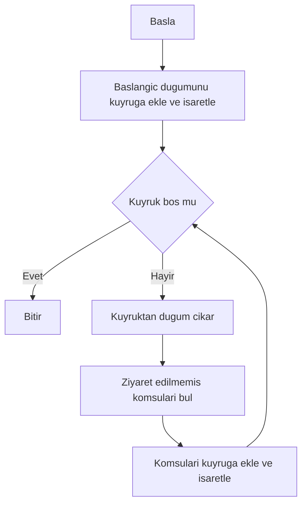
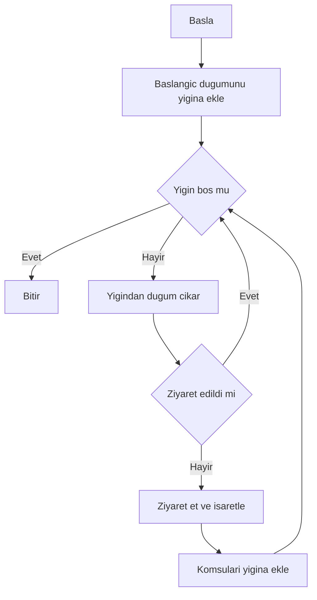
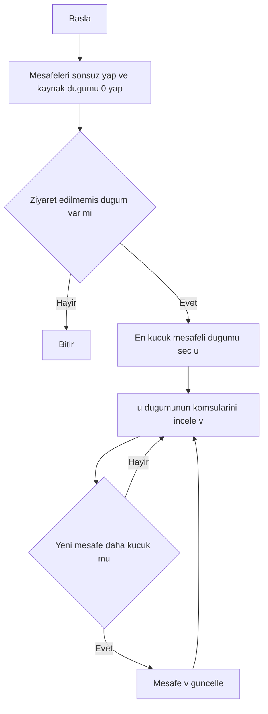
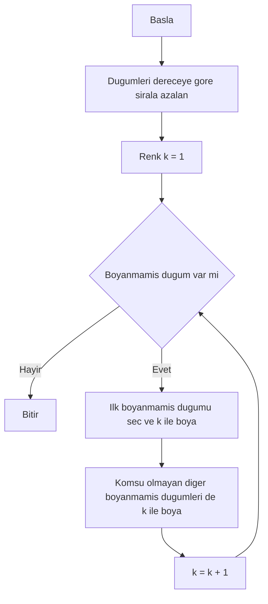
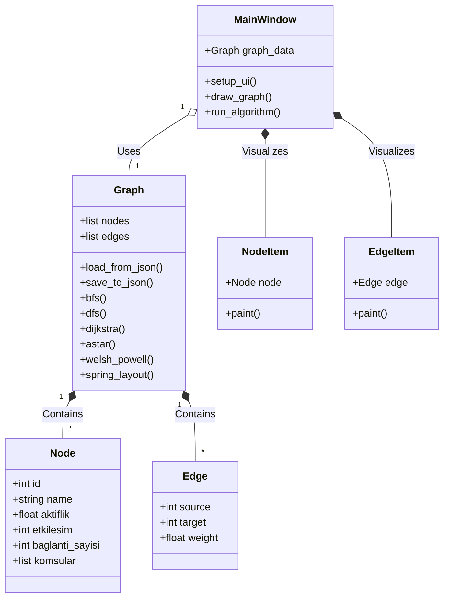
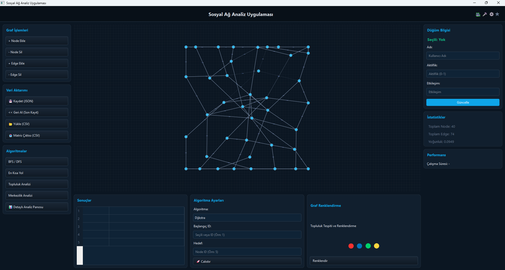
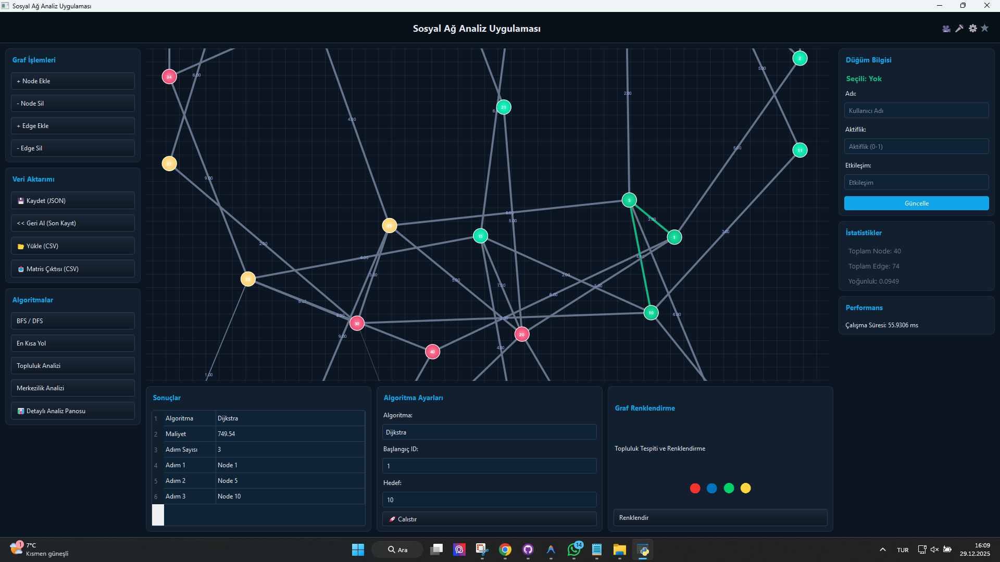
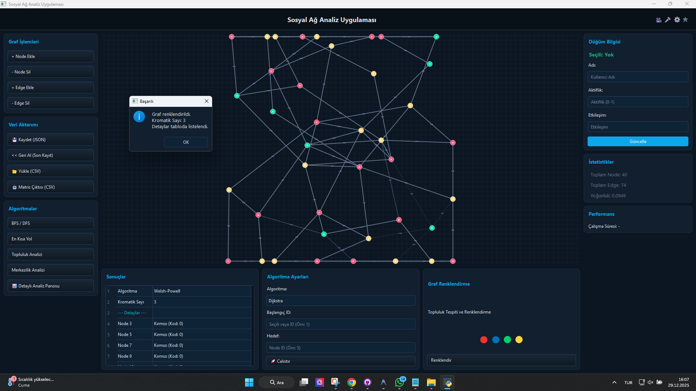

# YAZLAB2 - Sosyal Ağ Analizi ve Görselleştirme Aracı

## 1. Proje Bilgileri
**Proje Adı:** YAZLAB2 - Sosyal Ağ Analizi Uygulaması
**Ekip Üyeleri:**
*   Ebubekir Yılmaz - 231307044
*   Mehmet Biçer - 241307111
*   Tarih: 2026

---

## 2. Giriş (Introduction)

### Problemin Tanımı
Günümüzde sosyal ağlar, ulaşım ağları ve iletişim altyapıları gibi birçok karmaşık sistem, çizgeler (graphs) ile modellenebilmektedir. Ancak bu verilerin ham haliyle analizi ve anlaşılması zordur. Bu proje, düğümler (kullanıcılar/lokasyonlar) ve kenarlar (bağlantılar) arasındaki ilişkileri görselleştirmek, analiz etmek ve grafik teorisi problemlerine (en kısa yol, renklendirme, bağlantılı bileşenler vb.) çözüm üretmek amacıyla geliştirilmiştir.

### Amaç
Projenin temel amacı, kullanıcı dostu bir arayüz üzerinden:
*   Dinamik olarak düğüm ve kenar ekleyip çıkarabilmek,
*   Grafik üzerindeki topolojik analizleri (merkeziyet, bağlantılılık) yapabilmek,
*   Temel grafik algoritmalarını (BFS, DFS, Dijkstra, A*, Welsh-Powell) görsel ve interaktif bir şekilde çalıştırmaktır.

---

## 3. Algoritmalar

Projede kullanılan temel algoritmaların detayları aşağıdadır.

### 3.1. Breadth-First Search (BFS)
**Çalışma Mantığı:**  
Başlangıç düğümünden başlayarak, önce o düğümün tüm komşularını, ardından o komşuların komşularını ziyaret ederek ilerler (Katman katman arama).

**Karmaşıklık Analizi:**  
Tüm düğümler (V) ve kenarlar (E) en fazla bir kez işlendiği için zaman karmaşıklığı **O(V + E)**'dir.

**Akış Diyagramı:**

**Literatür İncelemesi:**
BFS, en kısa yol (ağırlıksız grafiklerde) bulma ve ağ tarama işlemlerinde standart bir yöntemdir (Moore, 1959).

---

### 3.2. Depth-First Search (DFS)
**Çalışma Mantığı:**
Başlangıç düğümünden başlayarak, bir kolda gidebileceği en son noktaya kadar derinlemesine ilerler, sonra geri dönerek (backtracking) diğer kolları gezer.

**Karmaşıklık Analizi:**
Zaman karmaşıklığı **O(V + E)**'dir.

**Akış Diyagramı:**

---

### 3.3. Dijkstra (En Kısa Yol)
**Çalışma Mantığı:**
Başlangıç düğümünden diğer tüm düğümlere olan en kısa mesafeyi hesaplar. "Greedy" (Açgözlü) bir yaklaşım izler ve her adımda henüz ziyaret edilmemiş, mesafesi en küçük olan düğümü seçer.

**Karmaşıklık Analizi:**
Mevcut implementasyonda (dizi/liste kullanarak): **O(V^2)**.  
(Priority Queue ile yapılsaydı O(E + V log V) olurdu).

**Akış Diyagramı:**

---

### 3.4. A* (A-Star) Algoritması
**Çalışma Mantığı:**
Dijkstra'nın gelişmiş halidir. Maliyet fonksiyonuna (g) ek olarak hedefe kalan tahmini mesafeyi (h - heuristic) de hesaba katar (f = g + h). Bu sayede hedefe daha hızlı yönelir.

**Heuristic:**
Bu projede düğümler arası özellik farkları (aktiflik, etkileşim vb.) heuristic olarak kullanılmıştır.

**Karmaşıklık Analizi:**
En kötü durumda **O(E)** (tüm kenarları gezer), ancak iyi bir heuristic ile çok daha hızlıdır.

---

### 3.5. Welsh-Powell (Graf Renklendirme)
**Çalışma Mantığı:**
Komşu düğümlerin farklı renklere sahip olması kuralına göre grafiği en az sayıda renkle boyamayı amaçlar.
1. Düğümleri derecelerine (bağlantı sayısı) göre büyükten küçüğe sırala.
2. İlk düğüme bir renk ver.
3. Listede sıradaki, bu renkli düğümle komşu olmayan düğümlere aynı rengi ver.
4. Yeni bir renk al ve boyanmamış düğümler için işlemi tekrarla.

**Karmaşıklık Analizi:**
Sıralama işlemi **O(V log V)**. Boyama işlemi O(V + E). Toplam: **O(V log V + E)**.

**Akış Diyagramı:**

---

## 4. Mimari ve Sınıf Yapısı

Proje, Python ve PyQt5 kullanılarak Nesne Yönelimli Programlama (OOP) prensiplerine uygun olarak geliştirilmiştir.

### Mermaid Class Diagram

**Modüller:**
*   `main.py`: Uygulamanın giriş noktası ve UI yönetimi (MainWindow).
*   `graph.py`: Veri yapısı ve algoritmaların bulunduğu çekirdek sınıf.
*   `node.py`: Düğüm veri modeli.
*   `edge.py`: Kenar veri modeli.
*   `dashboard.py` & `styles.py`: Arayüz bileşenleri ve stillendirme.
*   `data/`: JSON ve diğer veri dosyaları.

---

## 5. Uygulama Detayları ve Testler

### Ekran Görüntüleri

**Uygulamanın Genel Arayüzü**  

**Dijkstra Algoritması – En Kısa Yol**  

**Welsh-Powell – Graf Renklendirme Sonucu**  

### Test Senaryoları
1.  **En Kısa Yol Testi:**
    *   **Girdi:** Başlangıç ID: 1, Hedef ID: 10
    *   **Beklenen:** Dijkstra ve A* algoritmaları ile en düşük maliyetli yolun çizilmesi ve maliyetin gösterilmesi.
    *   **Sonuç:** En kısa yol başarıyla çizilmiş, toplam maliyet kullanıcıya gösterilmiştir.

2.  **Graf Renklendirme:**
    *   **Girdi:** Welsh-Powell algoritmasını çalıştır.
    *   **Beklenen:** Birbirine komşu düğümlerin farklı renklere boyanması ve Kromatik Sayı'nın gösterilmesi.
    *   **Sonuç:** Başarılı (Örn: Kromatik Sayı = 3).

3.  **Dosya Yükleme:**
    *   **Girdi:** `graph.json` veya CSV dosyası yükle.
    *   **Sonuç:** Grafiğin ekrana doğru şekilde, tüm düğüm ve bağlarla çizilmesi.

---

## 6. Sonuç ve Tartışma

### Başarılar
*   Karmaşık grafik algoritmaları görsel bir arayüz ile birleştirilmiştir.
*   Kullanıcı dostu, modern (Dark Theme) bir tasarım uygulanmıştır.
*   Hem JSON hem CSV formatında veri desteği sağlanmıştır.
*   Node'ların ekranda "Spring Layout" algoritması ile otomatik ve estetik yerleşimi sağlanmıştır.

### Sınırlılıklar
*   Çok büyük grafiklerde (1000+ düğüm) performans düşüşü yaşanabilir (Python/Qt çizim limitleri ve O(V^2) algoritmalar nedeniyle).
*   3 Boyutlu görselleştirme mevcut değildir.

### Olası Geliştirmeler
*   Algoritmaların adım adım (animasyonlu) oynatılması eklenebilir.
*   Veritabanı entegrasyonu ile büyük verilerde daha hızlı işlem yapılabilir.
*   Web tabanlı bir arayüze (React/D3.js) taşınabilir.
